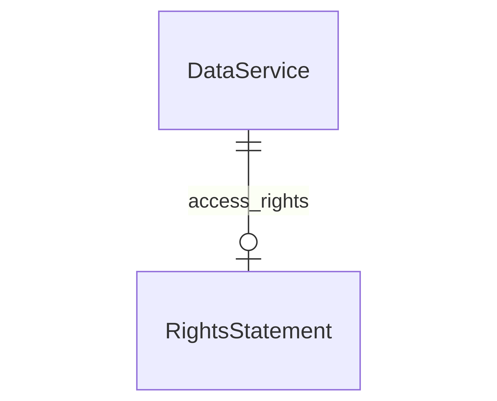

# Repository Services Registry Proof-of-Concept

## Data Model

**IN PROGRESS - incomplete**

Using [LinkML](https://linkml.io/) python library and application, to define the data model/schema for the registry entities in **[registry-schema.yaml](registry-schema.yaml)**

Start a python virtual environment
* with python virtual environment: `python3 -m venv venv`
* start virtual environment: `source venv/bin/activate`

Install requirements (LinkML):
* `pip install -r requirements.txt`

### Data Model Representations


* Entity-Relationship (ER) Diagram `gen-erdiagram --format mermaid  registry-schema.yaml -c DataService`
Copy output to https://mermaid.live 




## Data

Example data: [registry-data.ttl](registry-data.ttl)

Main Entities:
* `dcat:DataService` for describing Data Services 
* `org:Organization` for describing Organizations
* `vcard:Kind` for describing organization/service contact (see [^1])


Example SPARQL queries:


Run SPARQL queries: with [Apache Jena Commands](https://jena.apache.org/download/index.cgi) 


[registry-query01-DataServices.rq](registry-query01-DataServices.rq) - query: all instances of dcat:DataService and their properties and values

`arq --data registry-data.ttl --query registry-query01-DataServices.rq`

``` 
====================================================================================================================================================================================================================================================================================================
| edenr:service_1 | dct:description   | "A safe and sustainable long-term preservation archive that meets the highest archiving requirements. The DANS Data Vault contains all datasets that have been entrusted to DANS, including the data from the Data Stations and DataverseNL."@en |         |
| edenr:service_1 | rdf:type          | dcat:DataService                                                                                                                                                                                                                                 |         |
| edenr:service_1 | dcat:landingPage  | <https://catalog.vault.datastations.nl>                                                                                                                                                                                                          |         |
| edenr:service_1 | dcat:endpointURL  | <https://catalog.vault.datastations.nl>                                                                                                                                                                                                          |         |
| edenr:service_1 | rdfs:label        | "DANS Data Vault Catalog"@en                                                                                                                                                                                                                     |         |
| edenr:service_1 | dcat:contactPoint | edenr:contact_1                                                                                                                                                                                                                                  |         |
| edenr:service_1 | dct:title         | "DANS Data Vault Catalog"@en                                                                                                                                                                                                                     |         |
| edenr:service_1 | dct:publisher     | edenr:org_1                                                                                                                                                                                                                                      |         |
----------------------------------------------------------------------------------------------------------------------------------------------------------------------------------------------------------------------------------------------------------------------------------------------------
```


[registry-query02-Contact.rq](registry-query02-Contact.rq) - query: all instances of contacts (`vcard:Kind`) and their properties

`arq --data registry-data.ttl --query registry-query02-Contact.rq`

```
----------------------------------------------------------------------------------------------
| dataService     | prop           | val                                           | contact |
==============================================================================================
| edenr:contact_1 | vcard:hasEmail | <mailto:info@dans.knaw.nl>                    |         |
| edenr:contact_1 | rdf:type       | vcard:Kind                                    |         |
| edenr:contact_1 | vcard:fn       | "Data Archiving Networked Services (DANS)"@en |         |
| edenr:contact_1 | vcard:hasURL   | <https://dans.knaw.nl/>                       |         |
----------------------------------------------------------------------------------------------
```


[registry-query03-Orgs.rq](registry-query03-Orgs.rq) - query: all instances of Organizations (`org:Organization`) and their properties

`arq --data registry-data.ttl --query registry-query03-Orgs.rq`

```
----------------------------------------------------------------------------------------------
| dataService | prop               | val                                           | contact |
==============================================================================================
| edenr:org_1 | vcard:country-name | "The Netherlands"@en                          |         |
| edenr:org_1 | rdf:type           | org:Organization                              |         |
| edenr:org_1 | org:identifier     | <https://ror.org/008pnp284>                   |         |
| edenr:org_1 | geon:geonamesID    | <https://www.geonames.org/2747373>            |         |
| edenr:org_1 | foaf:name          | "Data Archiving Networked Services (DANS)"@en |         |
----------------------------------------------------------------------------------------------
```


# FOOTNOTES

* [^1]: More on Vcard in DCAT-AP: https://interoperable-europe.ec.europa.eu/collection/semic-support-centre/solution/dcat-application-profile-implementation-guidelines/release-0
